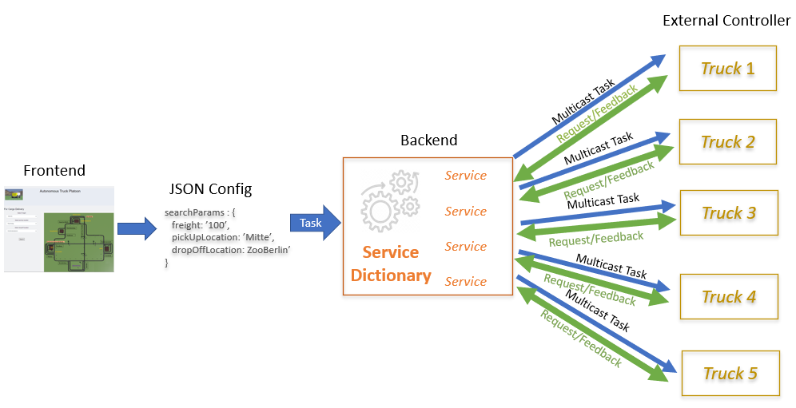

# Backend

## Overview

Backend is responsible for keeping track of all the Trucks statuses and serve as an intermittent node between Frontend UI and External controllers.

## Functionalities

We will use Backend as Service Manager which will provide multiple service ready to be served on a client request. In our case clients will be External controllers, Frontend user.
Services Backend provides:

1. Distribution of cargo between external controllers on a Frontend request using shortest path algorithm and custom cost function
2. Current status of each truck (position, free cargo space, busy)
3. Platoning Manager

More information about each functionality can be found in subdirectories.

## Instalation

Invoke in the /backend directory in order to install of the dependencies:

	sudo pip install -e .
	sudo apt install python3-numpy python3-pip python3-setuptools

Note that our project runs using Python 3.8.

## How to Run

The most important script is tcp_server_backend.py which is found under tcp_server/scripts/.
To run it, type in terminal:

	python3 tcp_server_backend.py
	

## Tests

Backend is supported and verified with unit tests using pytest. 
If any modification is done to the backend code, make sure you verify previous functionalities were not malfunctioned.
This is done by invoking:

	pytest

in the /test directory.
