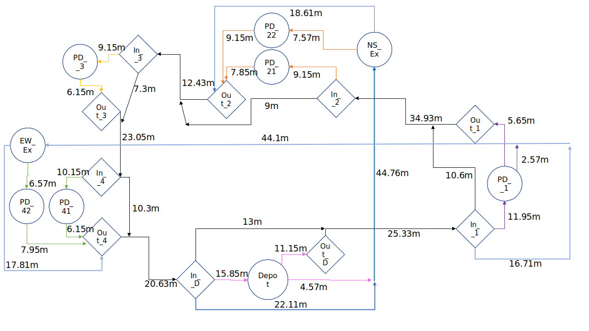

# Shortest Path Algorithm

## Overview

In this package We will be using Dijkstra Algorithm to evaluate the cost of a truck moving from current position to some final destination.

More on Dijkstra: https://en.wikipedia.org/wiki/Dijkstra%27s_algorithm

## Color Sequence and Cost

Depending upon from where(source) to where(destination) the shortest path is requested, a color sequence is formed with an optimal minimum cost.
Graph below denotes the connections of our environment. 
Note that to virtual nodes a Real world name is given in the Frontend.

Cost is equal to the distance between the two nodes, but the exception is Highway where the cost = 1 since we want our trucks to prefer driving through the highway, making platooning more possible.

## How to run

If you want to test how the code works, you can run dijkstra.py found in the /script directory.
Note that this script is run inside tcp_server_backend.py so no extra work is needed to run for our project.
