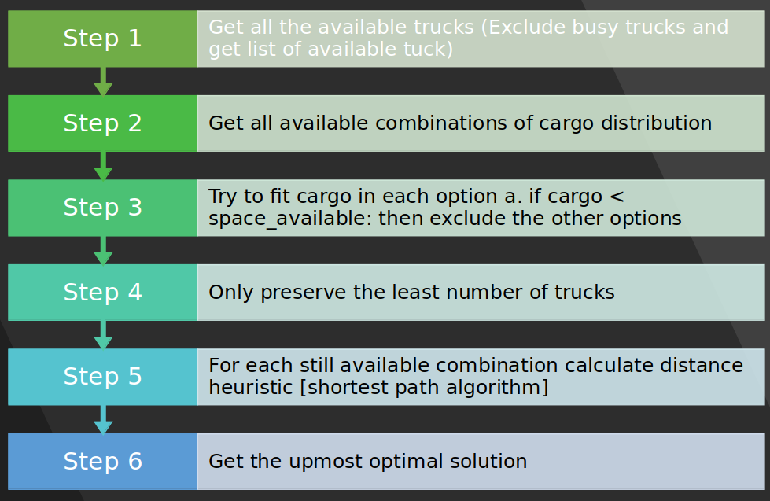
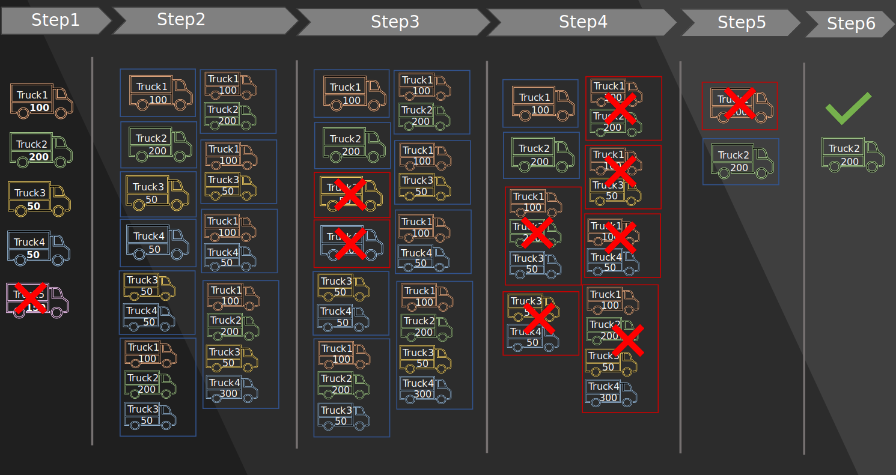

# TCP Socket I/O

This package provides I/O functionality to communicate with External Controller and Frontend through TCP Socket.

## TCP Server Meta-data

TCP Server is listening for new clients on: 
	
	**Port**: 65432
	**IP**: 127.0.0.1 (localhost)

Port can be arbitrarily set(usually >1023) while an IP is dependent upon on which machine clients and server are running.

## HandShake between External Controller and Backend

External controller and Backend communicate through TCP Socket. 
Backend acts as a TCP Server, whereas External Controllers and Frontend act as TCP Clients.

The purpose of our TCP Server is to act as a Service Provider. Each Service implements a certain functionality, client can use it in order to retreive or send a certain information from the backend system or to a certain client.

HandShake sequence is defined in the TCP packet data part.
Definition of HandShake - How TCP client should communicate with TCP Server
	
	<who-is-sending-the-info(e.g. client_X)> : <service-type(e.g. deliver-status)> : <additional-arguments(specified for each Service separately)>

## Services Definition

**Name**: deliver_status
**Brief**: In order for Backend Server to track all currenty available trucks and their states(free cargo space, position) clients need to call this service to update their state.
**Param**: client_id (e.g. client_X), free_cargo(e.g. 300[kg]), next_node (e.g. area), distance_from_next_node(e.g. 3.0) busy ('y' for available or 'n' for not available))
**Return**: String indicating successful update

**Name**: get_status
**Brief**: Retreives state information about a certain truck
**Param**: client_id (e.g. client_X)
**Return**: truck state
**Note**: Before calling this service an *deliver_status* service should be called

There are also Frontend Services you should not couple with ones above:
Frontend Services provide functionalities in order to transfer Frontend command to Task delegated to External Controller clients.

An example of a TCP Client in python calling **deliver_status** service and waiting for a server feedback::

	#!/usr/bin/env python3
	import socket

	HOST = '127.0.0.1'  # The server's hostname or IP address
	PORT = 65432        # The port used by the server

	with socket.socket(socket.AF_INET, socket.SOCK_STREAM) as s:
	    s.connect((HOST, PORT))
	    s.sendall(b'client_1 : deliver_status : client_1 : 75 : Depot : 4.0 : n')
	    while True:
		data = s.recv(1024)
		print(data)

	print('Received', repr(data))

## Distribution of cargo on Frontend Request

Frontend request is filtered through couple a steps denoted below. Primary goal is execute task optimally, therefore with this processing finding an optimal truck/s for the requested task.

 

## Protocol Definitions

Depending upon the client request, Backend retreives a feedback in a predefined form (protocol). 
Protocols we are using:
- After client delivers status to the Backend, it respond with a string:

		"Status succesfully updated"

- If the Frontend task engages only one truck, Backend send the respond to relevant client as: 

		"1:AMOUNT-OF-CARGO:COLOR-SEQUENCE"

- If the Frontend task engages not only one truck but multiple. Backend send the respond to relevant clients as above but additionaly if platooning is possible it sends back to:
	- Leader truck in the platoon:

			2:1:TruckID:Port:TruckID2:Port2: ....
	
	- To the each truck following the leader:

			2:0:TruckIDLeader:PortLeader:TruckIDInFront:PortInFront

