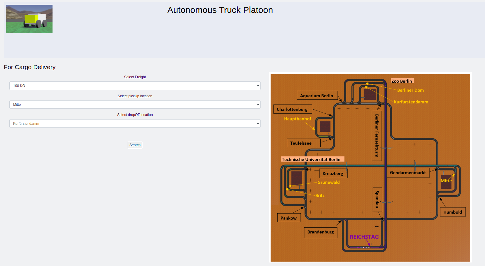

# Frontend 

## Overview
This directory frontend is developed in React App. React App is an officially supported way to create single-page React applications. It offers a modern build setup with no configuration.  Originally, it is developed for user to get trucks information to  

## Functionalities

We are consuming getTruckInfo method of backend api. On the frontend user is requseting to get a truck in the form of object to the api. For sending request to api, we have used axios to make an HTTP post request to the API. And if the response is success than this response is passed to the calling component/function. 

Frontend is mainly used to send requests to the Backend which distributes them forward to External controllers.

## Installation and Build

In order to install all neccesary packages, run in terminal:
First install Node.js version 14.0

	npm install

Then you can build oru project with:

	npm run build

In order to run it, you should invoke:
	
	npm run start

Which will open a new window where our Web App will be. 
If that is not the case open manually [http://localhost:3000](http://localhost:3000) to view it in the browser.

## Backend  Configuration
Backend developed in Python currently running on  [http://127.0.0.1:5000](http://127.0.0.1:5000) integrated in the frontend on directory `./services` with `truckService.js`

## Problems & Solutions

1. npm does not support Node.js v8.10.0:

First:

	sudo npm install npm@latest -g

Second:

	sudo npm install -g n

Third:

	sudo n latest

Then:

	sudo n stable

Finally:

	sudo n lts

2. npm install Please include the following file with any support request...Or sh: react-scripts: command not found after running npm start

First:

	sudo apt-get install nodejs-legacy

Second:

	sudo apt-get instatll npm
